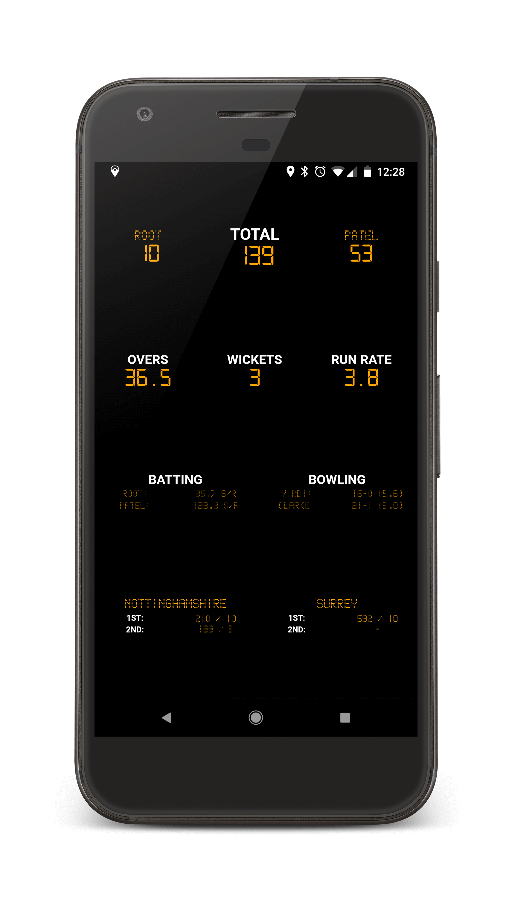

# Cricket Scoreboard 

This sinatra web application serves live scoreboards for professional cricket matches.


|  |  |
|:-----:|:----------:|
| Match List | Scoreboard |

# Running the project

## On Linux

```
$ bundle install
$ bin/scoreboard
```

Configuration can be managed using [config/scoreboard.yml](./config/scoreboard.yml)

## In Docker

```
$ docker build -t cricket-scoreboard .
$ docker run -it --name scoreboard -p 4567:4567 cricket-scoreboard
```

Configuration can be managed via environment variables.

## On Amazon ECS

Included below is an example task definition for running the application with an nginx sidecar for reverse proxy caching.

```
{
  "containerDefinitions": [
    {
      "cpu": 256,
      "essential": true,
      "image": "<nginx image URL here>",
      "links": [
        "sinatra"
      ],
      "linuxParameters": null,
      "logConfiguration": {
        "logDriver": "awslogs",
        "options": {
          "awslogs-group": "scoreboard",
          "awslogs-region": "<Logging region here>",
          "awslogs-stream-prefix": "cricket"
        }
      },
      "memory": 256,
      "name": "nginx",
      "portMappings": [
        {
          "containerPort": 80,
          "hostPort": 80,
          "protocol": "tcp"
        }
      ],
    },
    {
      "cpu": 256,
      "environment": [
        { "name": "LIST_CACHE_EXPIRY",  "value": "3600" },
        { "name": "MATCH_CACHE_EXPIRY", "value": "120" },
        { "name": "RACK_ENV",           "value": "production" },
        { "name": "LOG_LEVEL",          "value": "INFO" }
      ],
      "essential": true,
      "image": "<Sinatra image URL here>",
      "logConfiguration": {
        "logDriver": "awslogs",
        "options": {
          "awslogs-group": "scoreboard",
          "awslogs-region": "<Logging region here>",
          "awslogs-stream-prefix": "cricket"
        }
      },
      "memory": 256,
      "name": "sinatra"
    }
  ],
  "family": "cricket-scoreboard",
  "networkMode": "bridge"
}
```

The nginx container definition can be found in [config/nginx
](./config/nginx/).

# Contributing
The following command will run the test suite and generate the test coverage report.

```
$ rspec
```

Any code changes should be linted using [rubocop](https://github.com/rubocop-hq/rubocop) and [erblint](https://github.com/Shopify/erb-lint) before being committed.

```
$ rubocop
$ erblint --lint-all --enable-all-linters
```